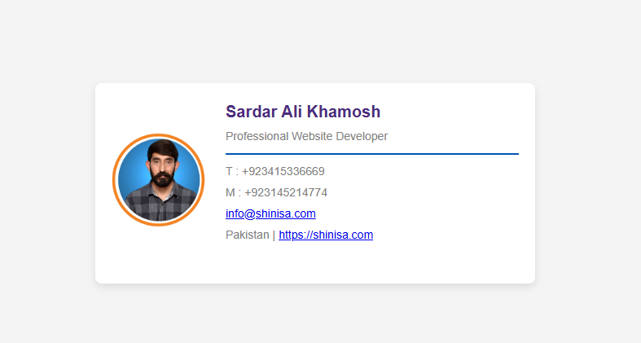

# Professional Digital Business Cards  

## Overview  

This repository contains elegant, responsive web-based business card templates designed for modern professionals. These cards feature a clean, corporate design that works seamlessly across devices.  

## Features  

✔ **Professional Layout** – Minimalist and well-structured design  
✔ **Contact Integration** – Phone, email, and social media links  
✔ **Responsive Design** – Adapts to desktop and mobile screens  
✔ **Customizable** – Easy to modify colors, logos, and details  
✔ **Fast-Loading** – Lightweight with minimal dependencies  

## How to Use  

1. **Clone the repository:**  
   ```bash
   git clone https://github.com/sardaralikhamosh/web-business-card.git
   ```  

2. **Customize the templates:**  
   - Edit personal details in the HTML files  
   - Replace logo images in the `/img` folder  
   - Adjust colors and styling as needed  

3. **Deploy** to your preferred web hosting service.  

## Included Templates  

- **`index.php`** – Main business card template  
- **`1.php`** – Alternate layout for team members  
- **`2.php`** – Variation with different contact arrangements  

## Author  

👨‍💻 **Sardar Ali Khamosh**  
📧 **Email:** sardaralikhamosh@gmail.com  
🔗 **LinkedIn:** [linkedin.com/in/sardaralikhamosh](https://linkedin.com/in/sardaralikhamosh)  
💻 **GitHub:** [github.com/sardaralikhamosh](https://github.com/sardaralikhamosh)  

## License  

This project is open-source under the **MIT License**. Feel free to use and modify it for personal or professional needs.  

## Contributions  

Suggestions and improvements are welcome! Fork the repository and submit a pull request.  

---

 **If you find this useful, consider giving it a star!** 
